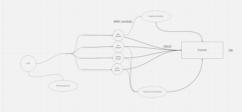

# serverless-api

## What is the root URL to your API?
https://4lcxb8fo12.execute-api.us-west-1.amazonaws.com/Production

## What are the routes,What inputs do they require, What output do they return ?
Route: /people

Method: GET
input: id for given item or nothing to return all items
ouput: array of objects or single object

Method: POST
input: first name, last name, age, gender
output: single object with input values and randomly generated id

Method: PUT
input: id and any combination of first name, last name, age, gender
output: single object with input values and input id

Method: DELETE
input: id
output: 'Record successfully destroyed'

